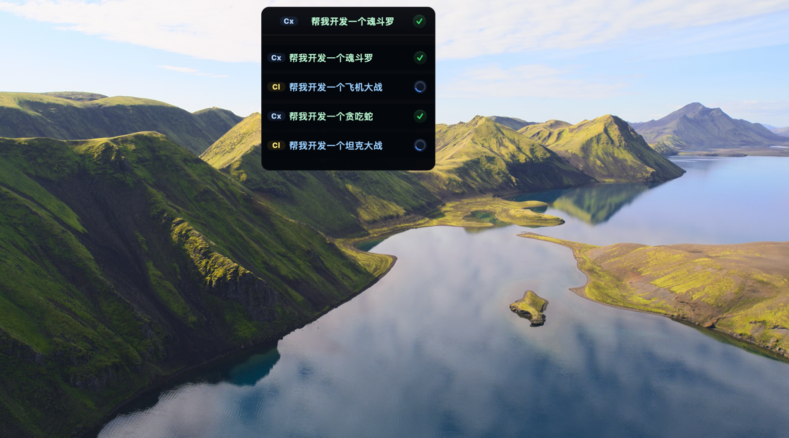

[中文说明](README.zh-CN.md)

# Aigeon

Aigeon is a lightweight macOS overlay for watching active `Claude Code` and `Codex` tasks without keeping every terminal frontmost.

## What It Does

- Currently supports monitoring tasks from:
  - `Claude Code`
  - `Codex`
- Tracks stable task state across `Claude Code` and `Codex`
- Shows the latest active task in a compact floating overlay
- Uses provider badges:
  - `Cl` for Claude Code
  - `Cx` for Codex
- Lets you click into the active task list and jump back to the matching terminal

## Modes

### 1. Standard Mode

- Shows the latest task summary plus its status icon
- Single-click the overlay bar to open the current task list
- Click a task row to focus the matching host terminal window
- Double-click the overlay bar to switch to Simple Mode

### 2. Simple Mode

- Shows compact counters for all stable task states
- Double-click the capsule to switch back to Standard Mode

## Stable Statuses

Aigeon currently normalizes task progress into four stable states:

- `booting`: the task/session has started but is not ready yet
- `waiting`: the agent is waiting for your reply or approval
- `running`: the agent is actively working
- `completed`: the task reached a finished terminal state

## Task Sounds

Aigeon currently plays sounds for:

- `waiting`
- `completed`

It does not play sounds for:

- `booting`
- `running`

## Terminal Focus Jump

In Standard Mode:

1. Single-click the overlay bar to open the task list
2. Click a task row
3. Aigeon tries to focus the matching host terminal

Current host-terminal support:

- macOS `Terminal`
- `Ghostty`

## Demo

### Standard Mode Screenshot

### Simple Mode Screenshot

### Demo Video

[Open demo video in browser](demo/demo-video.mov)

## Install

This release folder includes:

- `DMG`
- `.app`
- `.tar.gz`

Download links:

- [Download DMG installer](Aigeon_0.1.0_x64.dmg)
- [Download TAR.GZ app archive](Aigeon_0.1.0_x64.tar.gz)

The app is currently unsigned and not notarized. On first launch, macOS may block it.

If macOS blocks the app:

1. Try to open `Aigeon.app`
2. Open `System Settings > Privacy & Security`
3. Allow the blocked app
4. Launch it again

## Notes

- This public release package does not include source code
- The app behavior documented here reflects the current build only
