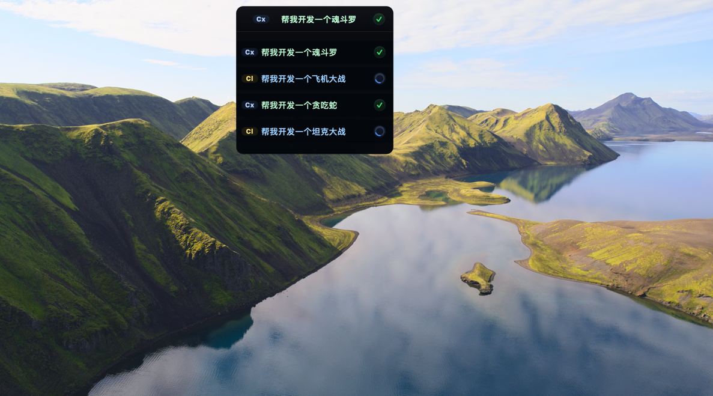
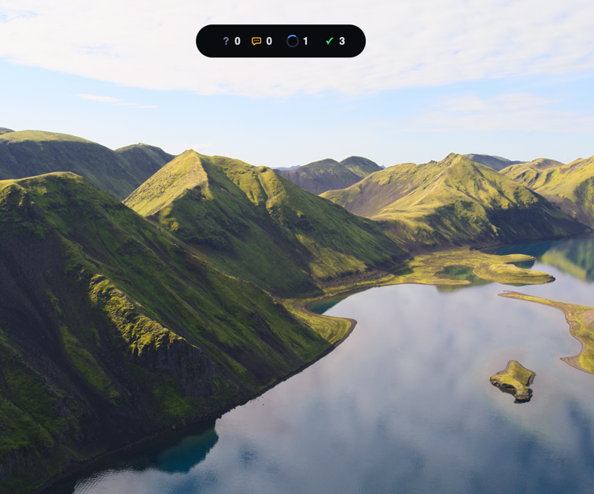

[English](README.md)

# Aigeon

Aigeon 是一个轻量的 macOS 悬浮层，用来观察当前 `Claude Code` 和 `Codex` 任务状态，不需要把所有终端一直放在最前面。

## 功能概览

- 当前支持监控的任务来源：
  - `Claude Code`
  - `Codex`
- 统一追踪 `Claude Code` 与 `Codex` 的稳定任务状态
- 在悬浮条里显示当前最新任务
- 用提供者标识区分来源：
  - `Cl` 表示 Claude Code
  - `Cx` 表示 Codex
- 可以打开任务列表，并跳回对应终端窗口

## 模式说明

### 1. 标准模式

- 显示最新任务摘要和对应状态图标
- 单击悬浮条可展开当前任务列表
- 单击任务行可聚焦到对应宿主终端
- 双击悬浮条切换到简单模式

### 2. 简单模式

- 以紧凑计数方式显示所有稳定状态的任务数量
- 双击胶囊条切回标准模式

## 当前稳定状态

Aigeon 当前把任务进度统一映射为四种稳定状态：

- `booting`：任务或会话刚启动，还未进入可交互阶段
- `waiting`：代理正在等待你的回复或授权
- `running`：代理正在执行任务
- `completed`：任务已经进入完成态

## 任务提示音

Aigeon 当前只会在以下状态播放提示音：

- `waiting`
- `completed`

以下状态不会播放提示音：

- `booting`
- `running`

## 点击任务后的终端跳转

在标准模式下：

1. 单击悬浮条打开任务列表
2. 单击某个任务行
3. Aigeon 会尝试聚焦到对应的宿主终端

当前支持的宿主终端：

- macOS `Terminal`
- `Ghostty`

## 演示素材

### 标准模式截图

### 简单模式截图

### 演示视频

[打开演示视频](demo/demo-video.mov)

## 安装说明

当前发布目录包含：

- `DMG`
- `.app`
- `.tar.gz`

这个版本目前没有签名，也没有做 notarization，所以首次打开时 macOS 可能会阻止启动。

如果 macOS 阻止打开：

1. 先尝试打开 `Aigeon.app`
2. 打开 `系统设置 > 隐私与安全性`
3. 允许被拦截的应用
4. 再次启动

## 说明

- 当前公开发布目录不包含源码
- 本说明仅对应当前这一个构建版本
